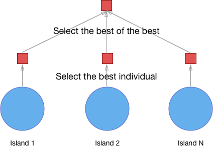
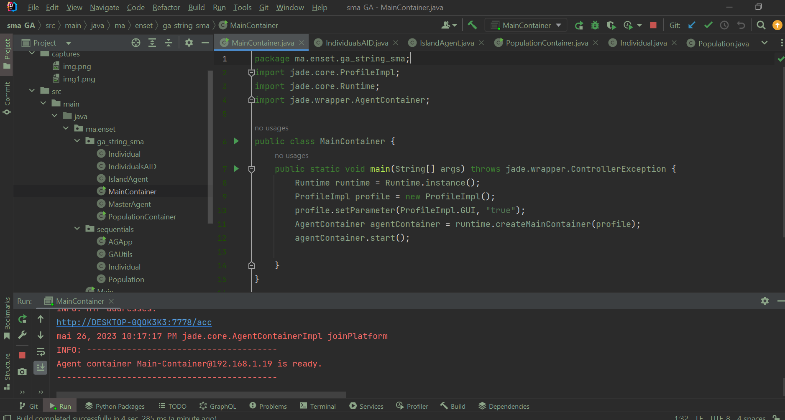
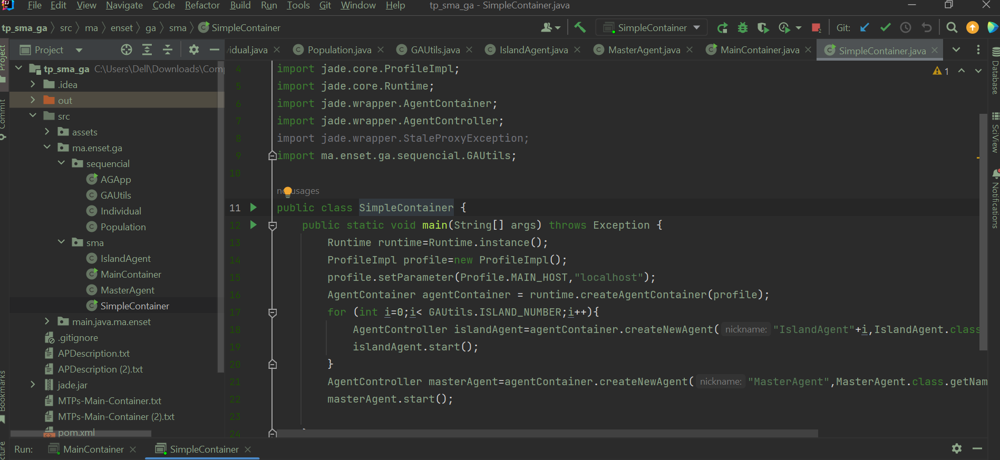
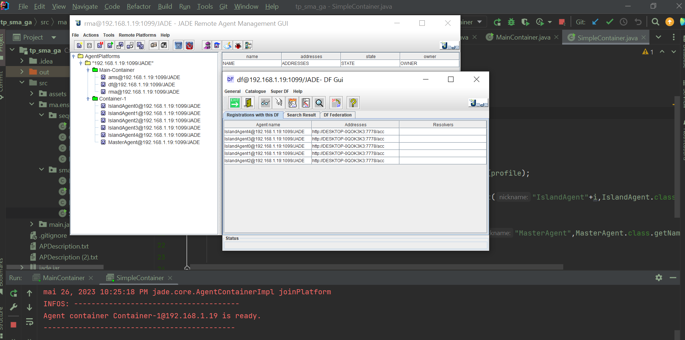

<h3>Deveoir : GA implementation usig MAS</h3>
<h1>compte rendu</h1> 
<h1>Beidja Cheikh </h1> 
<h2>Algorithme génétique parallèle</h2> 

L'algorithme génétique parallèle est un tel algorithme qui utilise plusieurs algorithmes génétiques pour résoudre une seule tâche [1]. Tous ces algorithmes essaient de résoudre la même tâche et après avoir terminé leur travail, le meilleur individu de chaque algorithme est sélectionné, puis le meilleur d'entre eux est sélectionné, et c'est la solution à un problème. C'est l'une des approches les plus populaires des algorithmes génétiques parallèles, même s'il en existe d'autres. Cette approche est souvent appelée «modèle insulaire» car les populations sont isolées les unes des autres, tout comme les populations de créatures réelles peuvent être isolées vivant sur différentes îles. L'image 1 illustre cela.

<h1>Implementation de l'algorithm</h1> 
<h3>MainContainer</h3>

<h3>SimpleContqner</h3>

<h3>Voici l'enregistrement de des services</h3>

<h3>IslandAgent</h3>

<h3>Démonstrations</h3>

